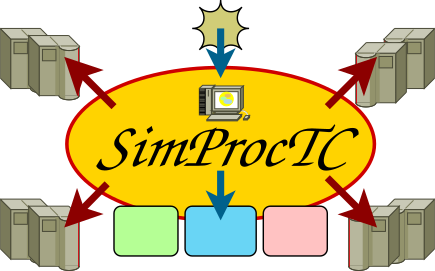

<h1 align="center">
 SimProcTC 
 A Simulation Processing Tool-Chain for OMNeT++ Simulations 
 <a href="https://www.nntb.no/~dreibh/omnetpp/">
   
  https://www.nntb.no/~dreibh/omnetpp
 </a>
</h1>

# 💡 What is SimProcTC (Simulation Processing Tool-Chain)?

In order to efficiently perform simulations using my [RSPSIM RSerPool simulation model](https://www.nntb.no/~dreibh/rserpool/) as well as simulations with the [CMT-SCTP model in the INET Framework](https://www.wiwi.uni-due.de/fileadmin/fileupload/I-TDR/SCTP/Paper/OMNeT__Workshop2010-SCTP.pdf), I have also developed a model-independent, flexible and powerful tool-chain for the setup, parallel run execution, results aggregation, data analysis and debugging – completely based on Open Source software: SimProcTC (Simulation Processing Tool-Chain). Due to its independence of a specific model, it may also be useful for many more users of OMNeT++.

Further details about SimProcTC can be found in Appendix&nbsp;B of «[Evaluation and Optimisation of Multi-Path Transport using the Stream Control Transmission Protocol](https://duepublico2.uni-due.de/servlets/MCRFileNodeServlet/duepublico_derivate_00029737/Dre2012_final.pdf#appendix.B)»!

# 📦 Installation of OMNeT++, SimProcTC and a Demo Simulation

The following items are a step-by-step installation guide for SimProcTC.

## Install OMNeT++

Get the latest version of [OMNeT++](https://omnetpp.org/) [here](https://omnetpp.org/download/) and install it under Linux. If you do not have Linux installed already, you may find my [Little Ubuntu Linux Installation Guide](https://www.nntb.no/~dreibh/ubuntu/index.html) helpful. This installation guide also provides help on how to install OMNeT++ on an Ubuntu system.
Note that while OMNeT++ also works under Microsoft Windows, my tool-chain has not been tested under this operating system, yet. In particular, run distribution using RSerPool will not work under Windows unless you port the [RSPLIB RSerPool implementation](https://www.nntb.no/~dreibh/rserpool/) to Windows.

After installing OMNeT++, make sure that it is working properly.

## Install GNU&nbsp;R

Install [GNU&nbsp;R](https://www.r-project.org/). Usually, it will be available for your Linux distribution as installation package. However, if you decide to install it from source, you can download the source [here](https://www.r-project.org/).
Under Ubuntu/Debian Linux, you can download and install GNU&nbsp;R using the following command line:

<pre>
sudo apt-get install r-base r-base-html r-base-dev r-doc-info r-doc-pdf r-doc-html r-mathlib
</pre>

After installation, you can start GNU&nbsp;R by:

<pre>
R --vanilla
</pre>

You can quit GNU&nbsp;R using Ctrl+D.

## Install libbz2

The simulation tool-chain requires libbz2 for compression and decompression of files. In particular, also the developer files (include files) of this library are required to compile the tool-chain. Usually, it will be available for your Linux distribution as installation package. However, if you decide to install it from source, you can download the source from [bzip2: Home](https://sourceware.org/bzip2/).
Under Ubuntu/Debian Linux, you can download and install libbz2 using the following command line:

<pre>
sudo apt-get install libbz2-dev
</pre>

## Install the Simulation Tool-Chain

Get the simulation tool-chain package from the [Build from Sources](#build-from-sources) section and unpack it. Also read the description paper in the docs/ directory; it gives important information on what the tool-chain actually does! The tool-chain archive includes the files of the tool chain as well as a small example simulation. The files have the following purposes:

* Tool-Chain Code:
  - <tt><a href="https://github.com/dreibh/simproctc/blob/master/toolchain/simulation.R">simulation.R</a></tt>: Generic simulation tool-chain code
  - <tt><a href="https://github.com/dreibh/simproctc/blob/master/toolchain/simulate-version1.R">simulate-version1.R</a></tt>: Model-specific simulation tool-chain code
  - <tt><a href="https://github.com/dreibh/simproctc/blob/master/toolchain/hashfunctions.R">hashfunctions.R</a></tt>: GNU R functions to calculate MD5 and SHA1 hashes
  - <tt><a href="https://github.com/dreibh/simproctc/blob/master/toolchain/plotter.R">plotter.R</a></tt>: GNU R functions for plotting
  - <tt><a href="https://github.com/dreibh/simproctc/blob/master/toolchain/get-libs">get-libs</a></tt>: Shell script to collect all shared libraries needed by the model
  - <tt><a href="https://github.com/dreibh/simproctc/blob/master/toolchain/get-neds">get-neds</a></tt>: Shell script to collect all NED files needed by the model
  - <tt><a href="https://github.com/dreibh/simproctc/blob/master/toolchain/test1.R">test1.R</a></tt>: Example simulation script
  - <tt><a href="https://github.com/dreibh/simproctc/blob/master/toolchain/plot-test1.R">plot-test1.R</a></tt>: Plotting script for the example * tools/ Sub-Directory:
    This directory contains the <tt>createsummary</tt> tool for scalar file processing.
* Run Distribution Code:
  - <tt><a href="https://github.com/dreibh/simproctc/blob/master/toolchain/ssdistribute">ssdistribute</a></tt>: Shell script to distribute runs in a computation pool
  - <tt><a href="https://github.com/dreibh/simproctc/blob/master/toolchain/ssrun">ssrun</a></tt>: Shell script to perform a simulation run (on a remote pool PC)
* example-simulation/ Sub-Directory:
    This directory contains the simple example model "example-simulation" for OMNeT++ 5.x/6.x.
  - <tt><a href="https://github.com/dreibh/simproctc/blob/master/example-simulation/scenario.ned">scenario.ned</a></tt>: NED file
  - <tt><a href="https://github.com/dreibh/simproctc/blob/master/example-simulation/messages.msg">messages.msg</a></tt>: Messages file
  - <tt><a href="https://github.com/dreibh/simproctc/blob/master/example-simulation/implementation.cc">implementation.cc</a></tt>: Model implementation
  - <tt><a href="https://github.com/dreibh/simproctc/blob/master/example-simulation/omnetpp.ini">omnetpp.ini</a></tt>: Example run for playing with the Tkenv/Cmdenv environments
simulation

In order to compile tool-chain and examples, call the following commands in the corresponding example-simulation subdirectory:

<pre>
opp_makemake -f
make
cd tools
make
cd ..
</pre>

Make sure that everything compiles successfully. Otherwise, the tool-chain will not work properly! After compilation, you can start the demo simulation by calling:

<pre>
./example-simulation
</pre>

# 🏃 Running the Demo Simulation

The example simulation packaged with SimProcTC simply presents the effects of fragmenting large packets into cells and forwarding them: the delays will significantly reduce at the price of increased overhead. Take a look into <tt><a href="https://github.com/dreibh/simproctc/blob/master/example-simulation/scenario.ned">scenario.ned</a></tt> to see the parameters of the model:

* fragmenterScenario.fragmenter.cellHeaderSize
* fragmenterScenario.fragmenter.cellPayloadSize
* fragmenterScenario.intermediateNodeOutputRate
* fragmenterScenario.sourceHeaderSize
* fragmenterScenario.sourcePayloadSize
* fragmenterScenario.sourceInterarrivalTime

An example simulation for this model is defined in <tt><a href="https://github.com/dreibh/simproctc/blob/master/toolchain/test1.R">test1.R</a></tt>: for each parameter of the model, the list "simulationConfigurations" contains a list with the parameter name as first element and its value(s) as further elements. For example, list("sourcePayloadSize", 1000, 2500) means that the parameter "sourcePayloadSize" should be used with the values 1000&nbsp;bytes and 2500&nbsp;bytes. For each parameter combination, a separate run will be created. Furthermore, the variable "simulationRuns" specifies how many different seeds should be used. That is, for simulationRuns=3, runs for each parameter combinations are created with 3&nbsp;different seeds (i.e.&nbsp;tripling the number of runs!).

The actual output of <tt>.ini</tt> files is realized in <tt><a href="https://github.com/dreibh/simproctc/blob/master/toolchain/simulate-version1.R">simulate-version1.R</a></tt>. Take a look over this file first, it should be quite self-explaining! In the function demoWriteParameterSection(), the actual lines for the parameters above are written for each simulation run. "simCreatorAdditionalActiveVariables" defines for which variables a table row should always be written. For example, if you always use cellHeaderSize=4, the <tt>createsummary</tt> tool would neglect this parameter in the output table. Since it may be useful for your post-processing, you can add it to "simCreatorAdditionalActiveVariables". Note, that "simCreatorWriteParameterSection" is set to "demoWriteParameterSection". In the generic <tt><a href="https://github.com/dreibh/simproctc/blob/master/toolchain/simulation.R">simulation.R</a></tt> script, always the names simCreator_XXX_ instead of demo_XXX_ are used. In order to be model-independent, it is necessary to set these variables to the actual model-dependent functions in simulate-version1.R! When you adapt the tool-chain to you own model, you only have to create your own <tt>simulation-version<em>X</em>.R</tt> script and leave the other scripts unmodified.

The variables "distributionPool" and "distributionProcs" in <tt><a href="https://github.com/dreibh/simproctc/blob/master/toolchain/test1.R">test1.R</a></tt> are used to control the request distribution. They will be explained later. For now, make sure that distributionProcs is set to&nbsp;0! This setting means that all runs are processed on the local machine.

Now, in order to perform the simulation defined in <tt><a href="https://github.com/dreibh/simproctc/blob/master/toolchain/test1.R">test1.R</a></tt>, simply execute <tt><a href="https://github.com/dreibh/simproctc/blob/master/toolchain/test1.R">test1.R</a></tt> using R:

<pre>
R --vanilla < test1.R
</pre>

The script will now create an <tt>.ini</tt> file for each run and a <tt>Makefile</tt> containing all runs. Finally, <tt>make</tt> will be called to process the created <tt>Makefile</tt>. <tt>make</tt> will already be called with the <tt>-j</tt> parameter corresponding to your number of CPUs/cores, so that it fully utilises the computation power of your machine. You can observe the progress of the simulation processing by monitoring the log file:

<pre>
tail -f test1/make.log
</pre>

You can abort the simulation processing and continue later. Only the run(s) currently in progress are lost and have to be re-processed upon resumption. Already completed runs are saved and no re-processing is necessary.

# 📈 Plotting the Results

After processing the simulation defined by <tt><a href="https://github.com/dreibh/simproctc/blob/master/toolchain/test1.R">test1.R</a></tt>, you can plot the results using <tt><a href="https://github.com/dreibh/simproctc/blob/master/toolchain/plot-test1.R">plot-test1.R</a></tt>:

<pre>
R --vanilla < plot-test1.R
</pre>

The results will be written to <tt>test1.pdf</tt> (the file name will be the simulation output directory + .pdf). You can view it with any PDF reader, e.g.&nbsp;[Okular](https://okular.kde.org/). The plotter settings at the head of <tt><a href="https://github.com/dreibh/simproctc/blob/master/toolchain/plot-test1.R">plot-test1.R</a></tt> should be almost self-explaining. For "colorMode", you can also use cmBlackAndWhite or cmGreyScale. Setting "plotOwnOutput" to TRUE results in an own output file for each plot (instead of a single PDF file). "plotConfigurations" contains the definitions for each plot, in particular title, output file name for "plotOwnOutput", x- and y-axis ticks, legend position and the results data for each axis given by a template. A set of model-specific templates is already defined in <tt><a href="https://github.com/dreibh/simproctc/blob/master/toolchain/simulate-version1.R">simulate-version1.R</a></tt>, you can add additional ones there or to "plotVariables" in <tt><a href="https://github.com/dreibh/simproctc/blob/master/toolchain/plot-test1.R">plot-test1.R</a></tt>. See also the paper for more details on templates.

# 🚀 Run Distribution to a Pool of PCs

Make sure that the previous steps (performing simulations and plotting) work. If they are not working properly, the run distribution will also fail! First, it is necessary to install the [RSPLIB RSerPool implementation](https://www.nntb.no/~dreibh/rserpool/). On a Ubuntu system, RSPLIB can be installed directly using APT:

<pre>
sudo apt-get install rsplib-registrar rsplib-services rsplib-tools
</pre>

In case of a need for a manual installation, also see the RSPLIB Handbook [here](https://www.nntb.no/~dreibh/rserpool/download/Handbook.pdf)!

One one computer, run CSP monitor to display the status of the other components:

<pre>
cspmonitor
</pre>

Note the IP address of this system. The CSP monitor runs on UDP port&nbsp;2960.

For the other components to be started, define environment variables:

<pre>
export CSP_SERVER=&lt;IP_OF_CSP_MONITOR&gt;:2960
export CSP_INTERVAL=333
</pre>

You can put these commands e.g.&nbsp;into ~/.bashrc, so that the variables are available in all new shell instances!

In your network, start at least one RSerPool Pool Registrar&nbsp;(PR):

<pre>
rspregistrar
</pre>

With the environment variables above set correctly, the CSP monitor should show the registrar.

Then, start a Scripting Service Pool Element&nbsp;(PE) in another shell.

<pre>
rspserver -scripting -policy=LeastUsed -ssmaxthreads=4
</pre>

The parameter <tt>-ssmaxthreads</tt> specifies the number of parallel sessions; use the number of cores/CPUs in your machine). The output of <tt>rspserver</tt> should look as follows:

<pre style="background: #5555dd22;">
Starting service ...
Scripting Server - Version 2.0
==============================

General Parameters:
   Pool Handle             = ScriptingPool
   Reregistration Interval = 30.000s
   Local Addresses         = { all }
   Runtime Limit           = off
   Max Threads             = 4
   Policy Settings
      Policy Type          = LeastUsed
      Load Degradation     = 0.000%
      Load DPF             = 0.000%
      Weight               = 0
      Weight DPF           = 0.000%
Scripting Parameters:
   Keep Temp Dirs          = no
   Verbose Mode            = no
   Transmit Timeout        = 30000 \[ms\]
   Keep-Alive Interval     = 15000 \[ms\]
   Keep-Alive Timeout      = 10000 \[ms\]
   Cache Max Size          = 131072 \[KiB\]
   Cache Max Entries       = 16
   Cache Directory         =
   Keyring                 =
   Trust DB                =
Registration:
   Identifier              = $249c7176
</pre>

In particular, take care of the "Identifier" line. This is the ID of the pool element under which it has been registered. If there are error messages saying that registration has failed, etc., have a look into the [RSPLIB documentation](https://www.nntb.no/~dreibh/rserpool/). Usually, this means a small configuration problem which can be solved easily! It may also be helpful to use [Wireshark](https://www.wireshark.org/) for debugging network issues; it has dissectors for the RSerPool protocols as well as for CSP and the Scripting Service protocols!

With the environment variables above set correctly, the CSP monitor should show the PE.

Take a look into the script <tt><a href="https://github.com/dreibh/simproctc/blob/master/toolchain/ssdistribute">ssdistribute</a></tt>. Ensure that the variable setting for _SIMULATION_POOLUSER_ points to the program <tt>scriptingclient</tt> of the RSPLIB package (if installed from the Ubuntu/Debian package: <tt>/usr/bin/scriptingclient</tt>).

<pre>
SIMULATION_POOLUSER=/usr/bin/scriptingclient
</pre>

If scriptingclient is located else where, e.g.&nbsp;<tt>$HIME/src/rsplib-3.5.4/src</tt> in your home directory, the line should be:

<pre>
SIMULATION_POOLUSER=~/src/rsplib-3.5.4/src/scriptingclient
</pre>

In <tt><a href="https://github.com/dreibh/simproctc/blob/master/toolchain/test1.R">test1.R</a></tt>, set "distributionProcs" to the maximum number of simultaneous sessions (at least&nbsp;1; if you later start 5&nbsp;pool elements with 2&nbsp;cores each, you should use&nbsp;10). It is safe to use&nbsp;1 for the following test. After modifying "distributionProcs", increase "simulationRuns" e.g.&nbsp;by&nbsp;1. Otherwise, since you have already performed the run of test1.R before, no more runs would be necessary (since their results are already there!). Now, run <tt><a href="https://github.com/dreibh/simproctc/blob/master/toolchain/test1.R">test1.R</a></tt> again:

<pre>
R --vanilla < test1.R
</pre>

Take a look at the output of <tt>rspserver</tt>: it should receive jobs and process them. Also, have a look at the log output:

<pre>
tail -f test1/make.log
</pre>

When the job distribution is working properly, you can start more pool elements and set up your simulation computation pool. Do not forget to increase "distributionProcs" accordingly!

With the environment variables above set correctly, the CSP monitor should show the status of pool users and pool elements during the simulation processing.

The workload distribution system works as follows:

* The <tt>Makefile</tt> first generates a Tar/BZip2 file <tt>simulation-environment.tar.bz2</tt> in the simulation directory. It contains the simulation binary, all shared libraries it needs (found out by the <tt><a href="https://github.com/dreibh/simproctc/blob/master/toolchain/get-libs">get-libs</a></tt> script), all .ned files it needs (found out by the <tt><a href="https://github.com/dreibh/simproctc/blob/master/toolchain/get-neds">get-neds</a></tt> script) and the script <tt>simulation.config-stage0</tt> which sets two environment variables: _SIMULATION_PROGRAM_ contains the name of the binary, _SIMULATION_LIBS_ contains the location of the libraries. If your simulation needs additional files, they can be specified by the variable _simulationMiscFiles_ in <tt><a href="https://github.com/dreibh/simproctc/blob/master/toolchain/simulate-version1.R">simulate-version1.R</a></tt>.

* <tt><a href="https://github.com/dreibh/simproctc/blob/master/toolchain/ssdistribute">ssdistribute</a></tt> – which is called to actually distribute a run to a pool – creates the Tar/GZip file for the run. This file includes the environment file (i.e.&nbsp;usually simulation-environment.tar.bz2) specified by the variable _SIMULATION_ENVIRONMENT_ and additional configuration files like <tt>simulation.config-stage0</tt> (but named <tt><a href="https://github.com/dreibh/simproctc/blob/master/toolchain/simulation.config-stage1">simulation.config-stage1</a></tt>, <tt>simulation.config-stage2</tt>, ...) specified by the environment variable _SIMULATION_CONFIGS_. You have to set these two environment variables in the <tt><a href="https://github.com/dreibh/simproctc/blob/master/toolchain/ssdistribute">ssdistribute</a></tt> script. Furthermore, the Tar/GZip file of the run contains the <tt>.ini</tt> file for the run.

* <tt><a href="https://github.com/dreibh/simproctc/blob/master/toolchain/ssrun">ssrun</a></tt> performs a run on a (usually) remote node. First, it finds all simulation.config-stageX scripts and executes them in alphabetical order. That is, <tt><a href="https://github.com/dreibh/simproctc/blob/master/toolchain/simulation.config-stage1">simulation.config-stage1</a></tt> may overwrite settings of <tt>simulation.config-stage0</tt> and so on. After that, it looks for <tt>.ini</tt> files. For each <tt>.ini</tt> file, it runs the program specified by the environemnt variable _SIMULATION_PROGRAM_. If the variable _SIMULATION_LIBS_ is set, does not call the binary directly but tells the shared library loader to do this and use the specified set of shared libraries.
If everything went well, a status file is created. The existence of this status file means that the run has been successful.

* Finding out what is going wrong with the remote execution can be difficult sometimes. In such a case, only start a single instance of <tt>rspserver</tt> and use the parameter <tt>-sskeeptempdirs</tt>. This parameter results in not deleting the temporary session directory after shutdown of the session. That is, you can dissect the directory's contents for troubleshooting. The name of the directory for each session is shown in the output of <tt>rspserver</tt>.

# 🔧 Adapting SimProcTC to your own simulation

In order to use SimProcTC with your own model, perform the following tasks:

* Copy the SimProcTC files to your model's directory: <tt><a href="https://github.com/dreibh/simproctc/blob/master/toolchain/ssrun">ssrun</a></tt>, <tt><a href="https://github.com/dreibh/simproctc/blob/master/toolchain/ssdistribute">ssdistribute</a></tt>, <tt><a href="https://github.com/dreibh/simproctc/blob/master/toolchain/simulation.R">simulation.R</a></tt>, <tt><a href="https://github.com/dreibh/simproctc/blob/master/toolchain/hashfunctions.R">hashfunctions.R</a></tt>, <tt><a href="https://github.com/dreibh/simproctc/blob/master/toolchain/plotter.R">plotter.R</a></tt>, <tt><a href="https://github.com/dreibh/simproctc/blob/master/toolchain/get-libs">get-libs</a></tt>, <tt><a href="https://github.com/dreibh/simproctc/blob/master/toolchain/get-neds">get-neds</a></tt>.
* Create a model-specifiy <tt>.ini</tt> file generation script (use <tt><a href="https://github.com/dreibh/simproctc/blob/master/toolchain/simulate-version1.R">simulate-version1.R</a></tt> of the demo simulation as a template).
* Create a simulation definition script (use <tt><a href="https://github.com/dreibh/simproctc/blob/master/toolchain/test1.R">test1.R</a></tt> of the demo simulation as a template).
* Create a plot script for your simulation (use <tt><a href="https://github.com/dreibh/simproctc/blob/master/toolchain/plot-test1.R">plot-test1.R</a></tt> of the demo simulation as a template).

Before using the RSerPool-based run distribution, first test your simulation on your local machine! This makes finding problems much easier. If everything works, you can continue with run distribution.

# 🖋️ Citing SimProcTC in Publications

SimProcTC and related BibTeX entries can be found in [AllReferences.bib](https://www.nntb.no/~dreibh/omnetpp/bibtex/AllReferences.bib)!

* [Dreibholz, Thomas](https://www.nntb.no/~dreibh/): «[Evaluation and Optimisation of Multi-Path Transport using the Stream Control Transmission Protocol](https://duepublico2.uni-due.de/servlets/MCRFileNodeServlet/duepublico_derivate_00029737/Dre2012_final.pdf)» ([PDF](https://duepublico2.uni-due.de/servlets/MCRFileNodeServlet/duepublico_derivate_00029737/Dre2012_final.pdf), 36779&nbsp;KiB, 264&nbsp;pages, 🇬🇧), Habilitation Treatise, University of Duisburg-Essen, Faculty of Economics, Institute for Computer Science and Business Information Systems, URN&nbsp;[urn:nbn:de:hbz:464-20120315-103208-1](https://nbn-resolving.org/urn:nbn:de:hbz:464-20120315-103208-1), March&nbsp;13, 2012.
* [Dreibholz, Thomas](https://www.nntb.no/~dreibh/); [Zhou, Xing](https://web.archive.org/web/20210517200550/https://hd.hainanu.edu.cn/scscs/info/1019/1029.htm) and [Rathgeb, Erwin Paul](https://web.archive.org/web/20241126012608/https://tdr.informatik.uni-due.de/en/team/erwin-p-rathgeb/): «[SimProcTC – The Design and Realization of a Powerful Tool-Chain for OMNeT++ Simulations](https://www.wiwi.uni-due.de/fileadmin/fileupload/I-TDR/ReliableServer/Publications/OMNeT__Workshop2009.pdf)» ([PDF](https://www.wiwi.uni-due.de/fileadmin/fileupload/I-TDR/ReliableServer/Publications/OMNeT__Workshop2009.pdf), 552&nbsp;KiB, 8&nbsp;pages, 🇬🇧), in *Proceedings of the 2nd ACM/ICST International Workshop on OMNeT++*, pp.&nbsp;1–8, DOI&nbsp;[10.4108/ICST.SIMUTOOLS2009.5517](https://dx.doi.org/10.4108/ICST.SIMUTOOLS2009.5517), ISBN&nbsp;978-963-9799-45-5, Rome/Italy, March&nbsp;6, 2009.
* [Dreibholz, Thomas](https://www.nntb.no/~dreibh/) and [Rathgeb, Erwin Paul](https://web.archive.org/web/20241126012608/https://tdr.informatik.uni-due.de/en/team/erwin-p-rathgeb/): «[A Powerful Tool-Chain for Setup, Distributed Processing, Analysis and Debugging of OMNeT++ Simulations](https://www.wiwi.uni-due.de/fileadmin/fileupload/I-TDR/ReliableServer/Publications/OMNeTWorkshop2008.pdf)» ([PDF](https://www.wiwi.uni-due.de/fileadmin/fileupload/I-TDR/ReliableServer/Publications/OMNeTWorkshop2008.pdf), 558&nbsp;KiB, 8&nbsp;pages, 🇬🇧), in *Proceedings of the 1st ACM/ICST International Workshop on OMNeT++*, DOI&nbsp;[10.4108/ICST.SIMUTOOLS2008.2990](https://dx.doi.org/10.4108/ICST.SIMUTOOLS2008.2990), ISBN&nbsp;978-963-9799-20-2, Marseille, Bouches-du-Rhône/France, March&nbsp;7, 2008.

# 💾 Build from Sources

SimProcTC is released under the [GNU General Public Licence&nbsp;(GPL)](https://www.gnu.org/licenses/gpl-3.0.en.html#license-text).

Please use the issue tracker at [https://github.com/dreibh/simproctc/issues](https://github.com/dreibh/simproctc/issues) to report bugs and issues!

## Development Version

The Git repository of the SimProcTC sources can be found at [https://github.com/dreibh/simproctc](https://github.com/dreibh/simproctc):

<pre>
git clone https://github.com/dreibh/simproctc
cd simproctc/tools
make
cd ..
</pre>

Contributions:

* Issue tracker: [https://github.com/dreibh/simproctc/issues](https://github.com/dreibh/simproctc/issues).
  Please submit bug reports, issues, questions, etc. in the issue tracker!

* Pull Requests for SimProcTC: [https://github.com/dreibh/simproctc/pulls](https://github.com/dreibh/simproctc/pulls).
  Your contributions to SimProcTC are always welcome!

## Release Versions

See [https://www.nntb.no/~dreibh/omnetpp/#current-stable-release](https://www.nntb.no/~dreibh/omnetpp/#current-stable-release) for release packages!

# 🔗 Useful Links

*   [OMNeT++ Simulation Toolkit Community Site](https://omnetpp.org/)
*   [The R Project for Statistical Computing](https://www.r-project.org)
*   [Thomas Dreibholz's Reliable Server Pooling (RSerPool) Page](https://www.nntb.no/~dreibh/rserpool/index.html)
*   [Thomas Dreibholz's Little Ubuntu Linux Installation Guide](https://www.nntb.no/~dreibh/ubuntu/index.html)
*   [Wireshark](https://www.wireshark.org/)
